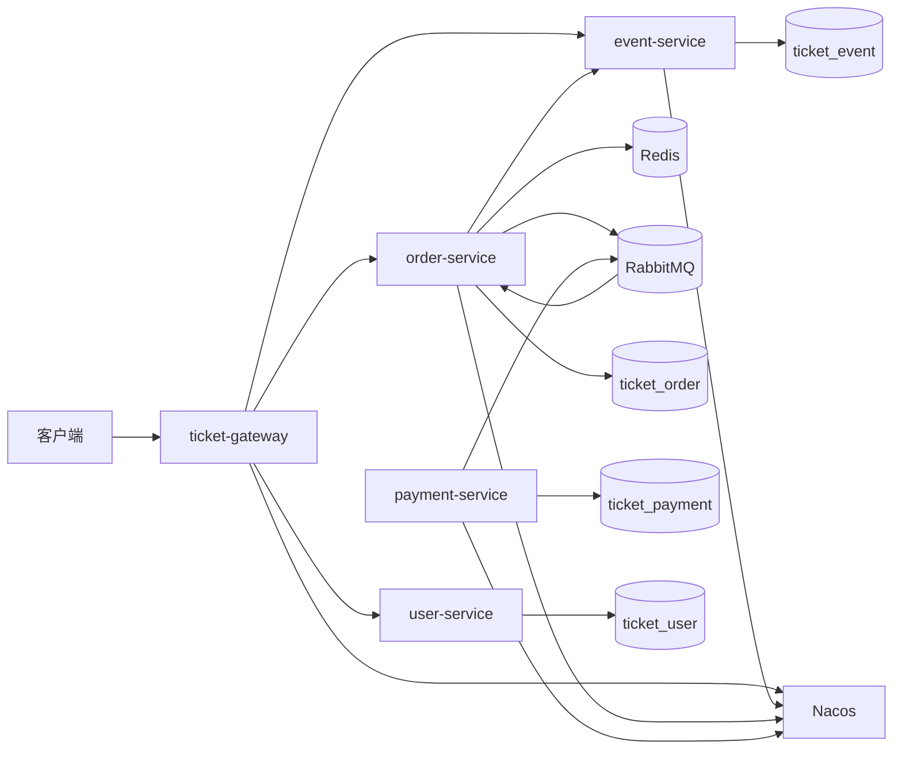
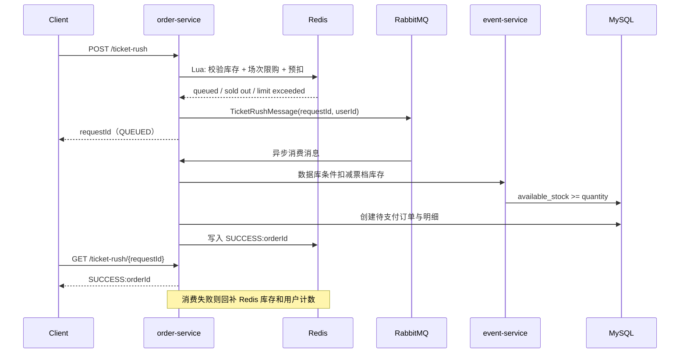
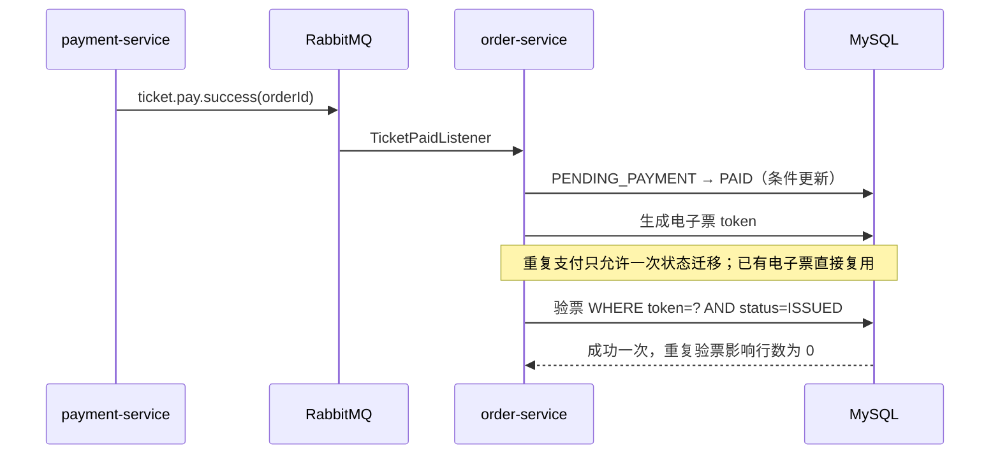
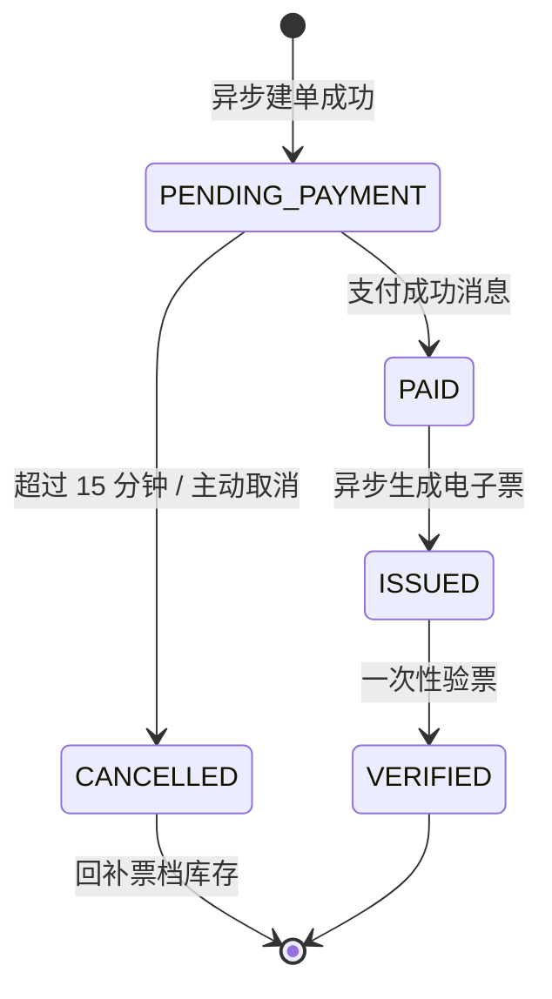

# 架构、时序与状态图

## 服务架构

## 抢票时序

## 支付、出票与验票

## 订单状态

## 一致性边界

- 抢票入口以 Redis Lua 处理热点库存与限购；它不是最终订单事实。
- MQ 消费者完成数据库订单与票档扣减；失败时补偿 Redis 预扣结果。
- 订单状态迁移、验票均采用条件更新，避免重复消息和重复请求导致多次生效。
- 真实支付、退款、选座和跨地域容灾不在当前版本范围内。
